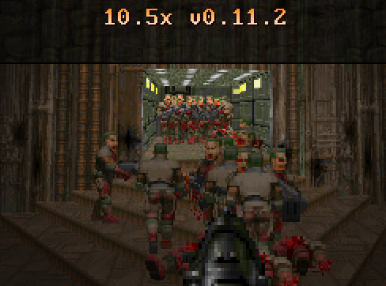
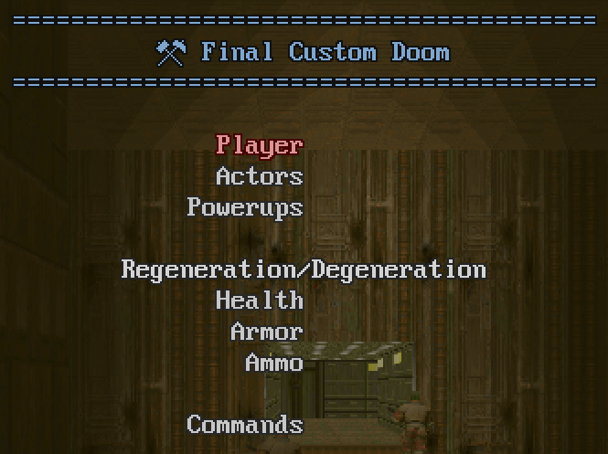
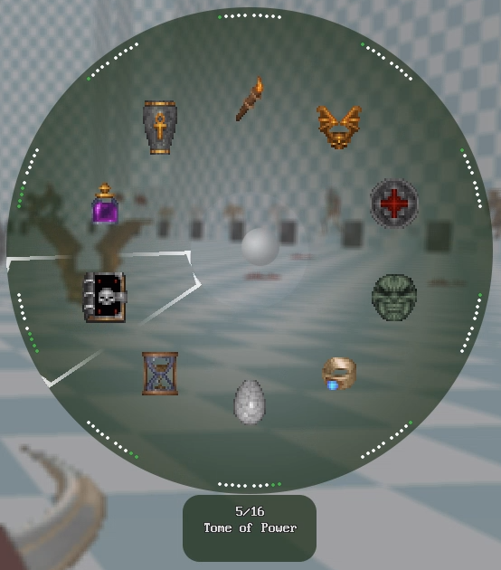
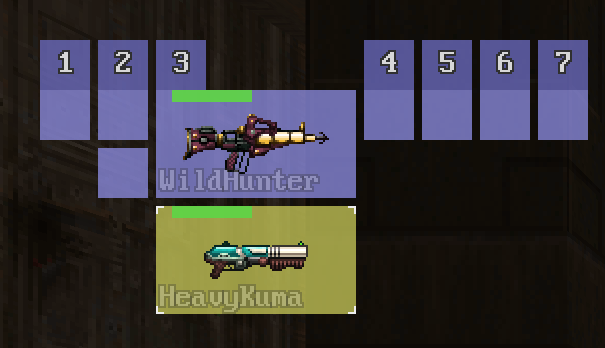
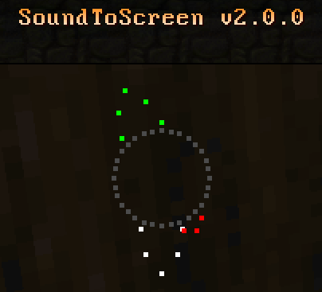
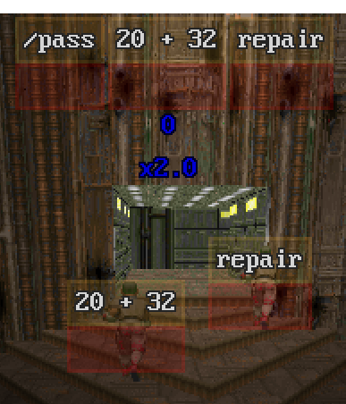

# SPDX-FileCopyrightText: © 2025 Alexander Kromm <mmaulwurff@gmail.com>
# SPDX-License-Identifier: CC0-1.0

#+title: DoomToolbox

* About

DoomToolbox is a collection of add-ons for Doom-based game engines which support
ZScript, like [[https://zdoom.org/downloads][UZDoom]].

DoomToolbox is free and open source software. Add-ons are mostly licensed under
[[file:LICENSES/GPL-3.0-only.txt][GPLv3]]. Modules are mostly licensed under [[file:LICENSES/BSD-3-Clause.txt][BSD-3-Clause]]. See ~SPDX-License-Identifier~
tag in each .org file for details. For third-party resources, such as image and sound
files, see ~REUSE.toml~ files in their directories for licenses.

[[file:documentation/Acknowledgments.org][Acknowledgments]]

HTML pages for DoomToolbox should be available [[https://mmaulwurff.github.io/doom-toolbox/][here]]. The source code is available on
[[https://github.com/mmaulwurff/doom-toolbox/][GitHub]] and [[https://codeberg.org/m8f/doom-toolbox][Codeberg]].

DoomToolbox has a [[https://www.doomworld.com/forum/topic/99760-doomtoolbox/][Doomworld topic]] and a [[https://mastodon.gamedev.place/@doomtoolbox][Mastodon page]]. Some add-ons and modules also
have a ZDoom forums thread.

This project doesn't use any AI tools.

** Add-ons

Add-ons:
- [[file:10.5x.org][10.5x]] - enemy number multiplier ([[https://forum.zdoom.org/viewtopic.php?t=65962][forum topic]])
- [[file:DoomDoctor.org][DoomDoctor]] - mod development and debugging utilities
- [[file:FinalCustomDoom.org][Final Custom Doom]] - gameplay customization options ([[https://forum.zdoom.org/viewtopic.php?t=64678][forum topic]])
- [[file:Gearbox.org][Gearbox]] - more convenient ways to select weapons and items ([[https://forum.zdoom.org/viewtopic.php?t=71086][forum topic]])
- [[file:Nomina.org][Nomina]] - enemy names helper ([[https://forum.zdoom.org/viewtopic.php?p=1150645][forum topic]])
- [[file:SoundToScreen.org][SoundToScreen]] - shows where sounds come from ([[https://forum.zdoom.org/viewtopic.php?p=1219682][forum topic]])
- [[file:Typist.pk3.org][Typist.pk3]] - turns FPS games into typing exercises ([[https://forum.zdoom.org/viewtopic.php?t=66042][forum topic]])
- [[file:WarmReception.org][WarmReception]] - alters enemy behavior on level start ([[https://forum.zdoom.org/viewtopic.php?t=69486][forum topic]])

Add-ons can be included and used in your projects. However, this is not recommended,
because when add-ons update, players won't be able to use new versions with your
project until you update the included add-on inside your project.

** Modules

- [[file:modules/Hint.org][Hint]] - hints for menu items
- [[file:modules/LazyPoints.org][LazyPoints]] - points scoring
- [[file:modules/libeye.org][libeye]] by KeksDose - level and screen projections
- [[file:modules/LispOnZscript.org][LispOnZscript]] - toy Lisp-like language on top of ZScript ([[https://forum.zdoom.org/viewtopic.php?t=80881][forum topic]])
- [[file:modules/MD5.org][MD5]] by 3saster - MD5 Implementation in ZScript
- [[file:modules/PlainTranslator.org][PlainTranslator]] - enables translation for plain text menu items
- [[file:modules/PreviousWeapon.org][PreviousWeapon]] - provides a key to select a previous weapon
- [[file:modules/StringUtils.org][StringUtils]] - string manipulation library
- [[file:modules/VmAbortReporter.org][VmAbortReporter]] - prints a report when VM abort happens

Modules are intended to be included as a part of other projects. Some DoomToolbox
add-ons include them.

* Gallery

10.5x:

Final Custom Doom:

Gearbox:

SoundToScreen:

Typist.pk3:

* Help appreciated

- playtesting: compatibility with games and mods, multiplayer
- UX suggestions: visuals, wording, usability
- code reviews: errors, style, readability
- code contributions: optimizations, features (try to keep project scope)

* Build

Build is supported on recent versions of GNU/Linux and Microsoft Windows.

To build:
1. Install Python, version >= 3.13
2. Install Emacs, version >= 30.1
3. Install UZDoom, version >= 4.14.3
4. Install development tools (probably from a [[https://docs.python.org/3/library/venv.html][venv]]):
   ~pip install -r tools/requirements-dev.txt~
5. In console in project directory, see what can be built with command:
   ~scons --help~
6. Build what you need.

To build add-on PK3, for example FinalCustomDoom, use this command: ~scons
FinalCustomDoom.pk3~. It will create FinalCustomDoom-NNNN.pk3 in directory ~build~.

To build a module so you can use it in your project, for example, ~StringUtils~, use
this command: ~scons StringUtils~. It will create directory ~StringUtils~ in
directory ~build~, which will contain ~StringUtils.zs~, in which you can replace
~NAMESPACE_~ with your unique namespace, and then include in your project.

All commands require that ~PATH~ environment variable has Emacs, tests also require
UZDoom in ~PATH~. All commands put their results in directory ~build~, and may remove
files and directories there.

Tests use internally:
- [[https://github.com/fragglet/miniwad][Miniwad]]: minimalist IWAD
- [[https://github.com/mmaulwurff/clematis][ClematisM]]: ZScript unit test framework

* Development

Used languages:
- add-ons, modules: ZScript (main), Emacs Lisp (supporting macros)
- build: Python (main), Emacs Lisp (helper functions)

Python or Emacs Lisp knowledge is not needed to contribute to add-ons and modules.

[[https://prek.j178.dev/][prek]] must be installed in Git repository for pre-commit checks.

Optional: Org mode extension for your preferred text editor, if it's not Emacs. Org
mode files can be edited as plain text, but an extension should add convenience
features such as syntax highlighting.

Documentation:
- [[file:documentation/CodeOfConduct.org][Code of conduct]]
- [[file:documentation/CodeStyle.org][Code style]]
- [[file:documentation/MadeWith.org][Made with]]
- [[file:documentation/WhereAreTheProjectFiles.org][Where are the project files?]]
